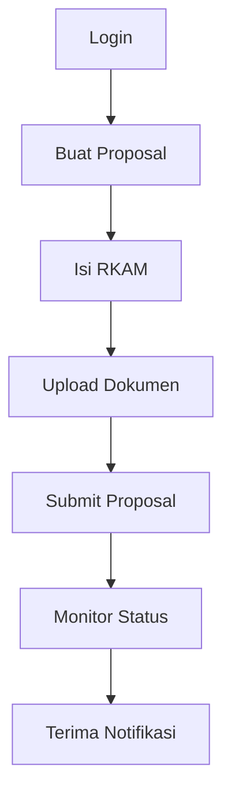
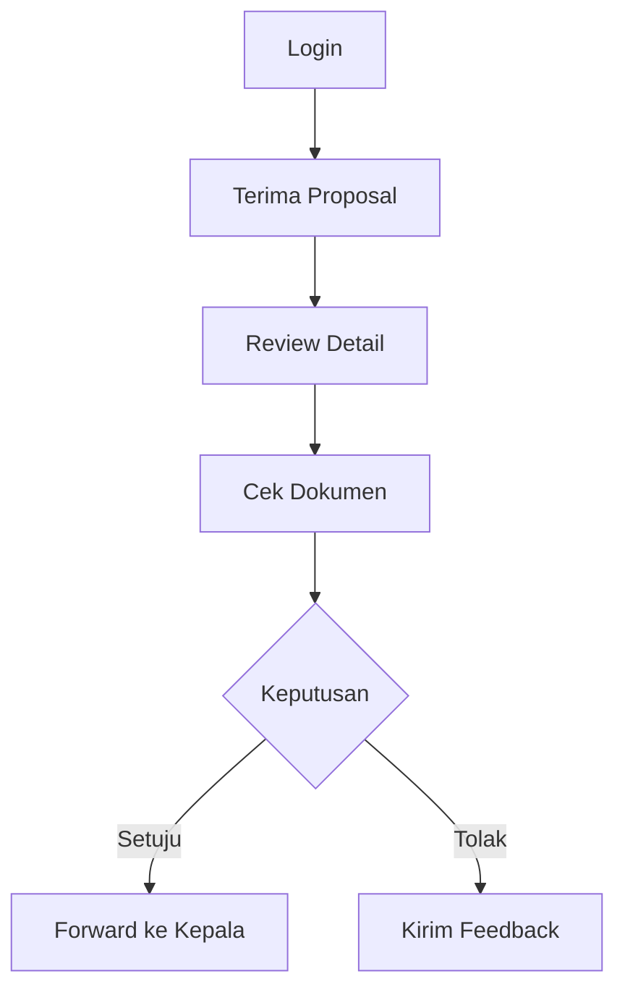
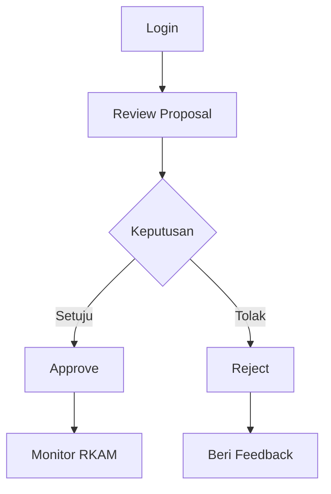
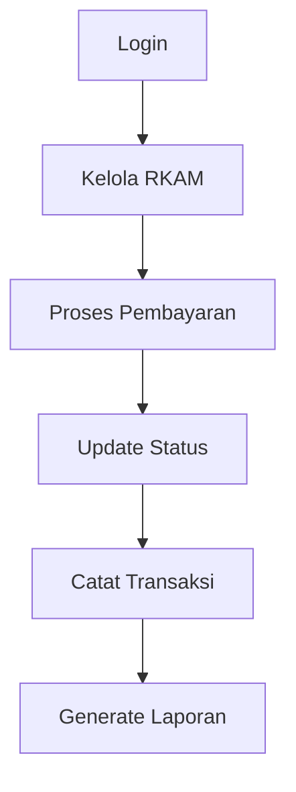
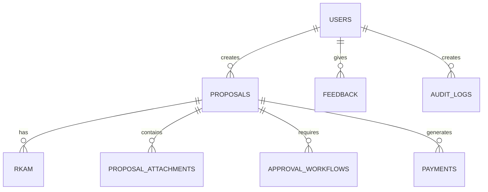

# 🎯 SiRangkul System Flow Documentation

## 📑 Table of Contents
- [Role Overview](#role-overview)
- [Detailed Role Flows](#detailed-role-flows)
- [Database Integration](#database-integration)
- [Approval Flow](#approval-flow)

## 🎭 Role Overview

| Role | Description | Primary Tables |
|------|-------------|----------------|
| 👨‍💼 Pengusul | Membuat dan mengajukan proposal | `proposals`, `rkam`, `proposal_attachments` |
| 👨‍🔬 Verifikator | Memverifikasi dan menyetujui proposal | `approval_workflows`, `feedback` |
| 👨‍💼 Kepala Madrasah | Memberikan persetujuan akhir | `approval_workflows`, `rkam` |
| 💰 Bendahara | Mengelola pembayaran dan RKAM | `payments`, `rkam` |
| 👥 Komite Madrasah | Memberikan rekomendasi dan persetujuan | `approval_workflows` |
| ⚙️ Administrator | Mengelola sistem dan pengguna | `users`, `audit_logs` |

## 📋 Detailed Role Flows

### 👨‍💼 Pengusul Flow


### 👨‍🔬 Verifikator Flow


### 👨‍💼 Kepala Madrasah Flow


### 💰 Bendahara Flow


## 🗄️ Database Integration

### Core Tables Relationship


## ⚡ Approval Flow

> ### Status Progress
> ```
> [Draft] ➡️ [Submitted] ➡️ [Verified] ➡️ [Approved] ➡️ [Paid]
> ```

### Detailed Approval Process
1. **Draft Creation** 📝
   - Table: `proposals`
   - Status: "draft"
   - Actor: Pengusul

2. **Submission** 📤
   - Table: `proposals`
   - Status: "submitted"
   - Actor: Pengusul

3. **Verification** ✅
   - Table: `approval_workflows`
   - Status: "pending" → "approved"/"rejected"
   - Actor: Verifikator

4. **Final Approval** 👔
   - Table: `approval_workflows`
   - Status: "pending" → "approved"/"rejected"
   - Actor: Kepala Madrasah

5. **Payment Processing** 💳
   - Table: `payments`
   - Status: "pending" → "paid"
   - Actor: Bendahara

## 🔔 System Features

### Notification System
- 📨 Automatic notifications on status changes
- 📊 Real-time updates
- 📱 Multi-channel delivery

### Audit Trail
- 📝 All actions logged
- 🕒 Timestamp tracking
- 👤 User attribution

### Document Management
- 📁 Secure file storage
- 🔍 Version control
- 📎 Multiple attachment support

## 💡 Best Practices

### Security
- 🔐 Role-based access control
- 🔒 Encrypted data transmission
- 🛡️ Input validation

### Performance
- ⚡ Optimized queries
- 🚀 Efficient file handling
- 📊 Caching strategies

### Monitoring
- 📈 Performance metrics
- 🔍 Error tracking
- 📊 Usage analytics

---

<div align="center">

**Made with ❤️ for SiRangkul System**

[Documentation](#) | [Support](#) | [Contact](#)

</div>